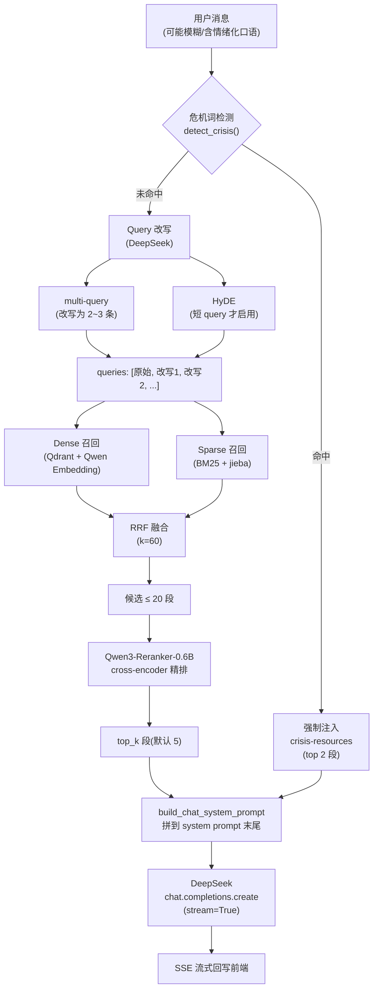
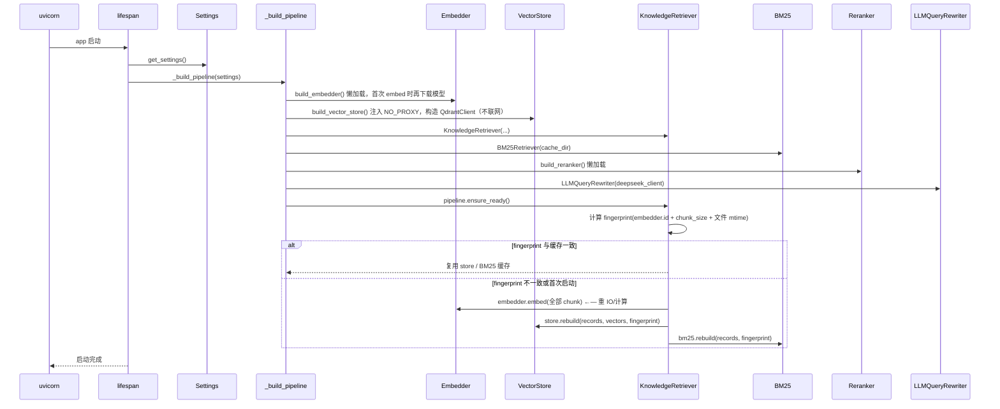
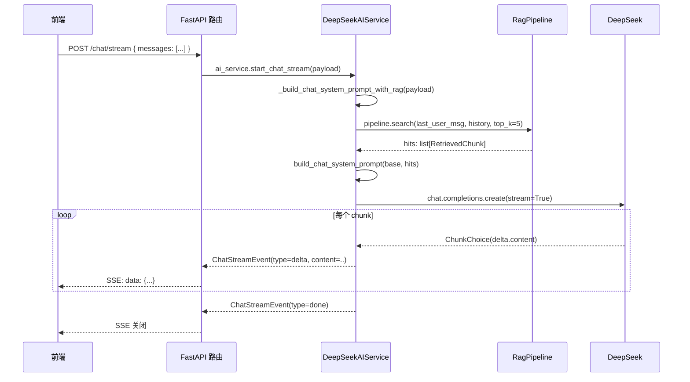
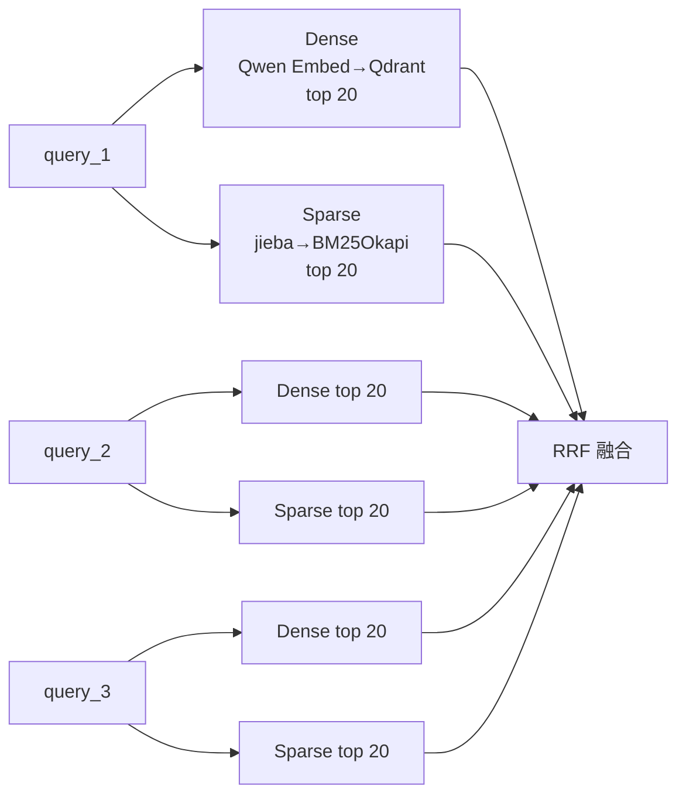

# ai-service RAG 完整流程说明

> 本文档是 RAG 系统的**流程视角**说明（数据怎么流、每一步在做什么、关键决策为什么这样）。
> 部署 / 配置 / 排错相关请看同目录的 [`RAG说明.md`](./RAG说明.md)，两者互补。

---

## 一、总览

### 1.1 角色与边界

- **作用范围**：仅在"陪伴聊天"接口（`POST /internal/v1/chat/stream`）生效；日记 AI 分析（`/internal/v1/mood/analyze`）走原始 LLM，**不**注入检索内容。
- **作用方式**：对用户最新一条消息执行完整 RAG 流水线（危机词兜底 → 改写 → 多路召回 → 融合 → 重排序），从 70+ 篇本地心理健康知识库取若干片段，拼到 system prompt 末尾，再交给 DeepSeek 流式生成。
- **不涉及**：用户的日记、聊天历史 **不会** 进知识库（避免跨用户隐私交叉）。

### 1.2 整体数据流



### 1.3 模块速查表

| 文件 | 主要类 / 函数 | 角色 |
|---|---|---|
| `main.py` | `Settings`, `lifespan`, `DeepSeekAIService`, `_build_pipeline` | FastAPI 入口、配置、流式聊天、装配 pipeline |
| `pipeline.py` | `RagPipeline.search`, `_multi_route_recall`, `reciprocal_rank_fusion` | **流水线编排**：改写 → 召回 → 融合 → 重排 |
| `rag.py` | `KnowledgeRetriever`, `Embedder`, `build_chat_system_prompt` | 知识切分、嵌入、查询缓存、prompt 拼接 |
| `vector_stores.py` | `QdrantVectorStore`, `FaissVectorStore`, `infer_category` | 向量库抽象 + 知识分类映射 + 系统代理自动旁路 |
| `bm25_index.py` | `BM25Retriever`, `_Tokenizer` | BM25 稀疏检索 + jieba 中文分词 |
| `rerankers.py` | `QwenLocalReranker`, `NoopReranker` | 重排序（Qwen3-Reranker yes/no 概率打分） |
| `query_rewriter.py` | `LLMQueryRewriter`, `detect_crisis` | 危机词检测 + multi-query + HyDE |

---

## 二、启动期流程

### 2.1 进程启动顺序

`main.py` 顶部的 import 顺序是**强约束**，不能随便调：

```python
1. import dotenv -> load_dotenv()        # 先把 .env 注入到 os.environ（HF_ENDPOINT 等才能被第三方库看见）
2. import fastapi / openai / pydantic    # 普通业务依赖
3. import bm25_index / pipeline / rag    # 内部模块，初始化时不联网
4. _configure_logging()                  # 接管 uvicorn 的 logger
```

为什么必须 `load_dotenv()` 在最前：
- `pydantic-settings` **只**把 `.env` 读进 `Settings` 字段，**不会**写回 `os.environ`。
- 但 `huggingface_hub` / `transformers` 等库读的是 `os.environ['HF_ENDPOINT']`、`os.environ['HTTPS_PROXY']`。
- 不显式 `load_dotenv()`，国内镜像、代理、离线模式等环境变量都不生效。

### 2.2 Settings 加载（pydantic-settings）

`main.py: Settings` 包含全部业务可配置项，通过 `.env` 覆盖。关键配置组：

| 组别 | 字段前缀 | 说明 |
|---|---|---|
| DeepSeek | `DEEPSEEK_*`, `AI_SERVICE_MAX_OUTPUT_TOKENS` | LLM 上游配置 |
| RAG 总开关 / 切分 | `RAG_ENABLED`, `RAG_TOP_K`, `RAG_CHUNK_SIZE`, `RAG_CHUNK_OVERLAP` | 是否启用、检索数、切分策略 |
| Embedder | `RAG_EMBEDDER`, `QWEN_EMBED_*`, `DASHSCOPE_*` | 嵌入器选择 |
| Vector Store | `RAG_VECTOR_STORE`, `QDRANT_*` | 向量库选择 |
| 多路召回 | `RAG_ENABLE_BM25`, `RAG_CANDIDATE_POOL`, `RAG_RRF_K` | dense + sparse 融合 |
| 重排序 | `RAG_RERANKER`, `RAG_ENABLE_RERANK`, `QWEN_RERANK_*`, `RAG_RERANK_INPUT_SIZE` | 精排参数 |
| 改写 | `RAG_ENABLE_QUERY_REWRITE`, `RAG_ENABLE_MULTI_QUERY`, `RAG_ENABLE_HYDE`, `RAG_MAX_REWRITES` | 查询扩展 |
| 危机兜底 | `RAG_CRISIS_FORCE_INJECT`, `RAG_CRISIS_TOP_K` | 危机场景安全兜底 |

`model_config = SettingsConfigDict(extra="ignore")` 让 `Settings` 忽略 `.env` 里未声明的字段（例如 `HF_ENDPOINT`、`HTTPS_PROXY` 等给第三方库的环境变量），避免无意中加一行 .env 就启动失败。

### 2.3 RAG 预热（lifespan）



### 2.4 首次嵌入 vs 增量启动

**首次启动**（`knowledge/.cache/` 为空）：
1. 下载模型：Qwen3-Embedding-0.6B (1.2GB) + Qwen3-Reranker-0.6B (1.2GB)，从 `HF_ENDPOINT` 镜像。
2. 切分 70 篇 Markdown → ~400 段。
3. 全量 embedding（GPU 上 ~10s，CPU 上几分钟）。
4. 写入 Qdrant `mental_health_knowledge` collection + 落盘 BM25 pickle。
5. 落盘指纹到 `qdrant_meta.json`、`bm25_index.pkl`。

**第二次启动**：
1. 模型已在 HF cache，秒级加载（仍是懒加载，首次推理才加载到内存）。
2. 计算 fingerprint，与磁盘缓存一致 → **直接复用**，跳过 embedding。

### 2.5 索引指纹机制

```python
# rag.py: KnowledgeRetriever._fingerprint
sha256({
  "embedder": embedder.identifier,      # 例：local::Qwen/Qwen3-Embedding-0.6B::qpn=query
  "store":    store.backend_name,       # qdrant / faiss
  "chunk_size":    400,
  "chunk_overlap": 60,
  "files":    [{"name": "...", "size": ..., "mtime": ...}, ...]
})
```

**何时自动重建**：任一项变化就触发——换 embedder、换 chunk 大小、改了任何 .md 文件、删了文件……都会让指纹变化，下次启动自动重新嵌入。无需手动清缓存。

---

## 三、运行期主链路（聊天）

### 3.1 入口：`POST /internal/v1/chat/stream`



### 3.2 RAG 检索调用链

```python
# main.py: DeepSeekAIService._build_chat_system_prompt_with_rag
last_user_message = next((m for m in reversed(payload.messages) if m.role == "user"), None)
history = [m for m in payload.messages if m is not last_user_message]

hits = self.retriever.search(           # ← retriever 实际是 RagPipeline 实例
    last_user_message.content,
    history=history,
    top_k=settings.rag_top_k,           # 5
    min_score=settings.rag_min_score,   # 0.0（详见 §4.2）
)

system_prompt = build_chat_system_prompt(base_prompt, hits)
```

下面拆解 `RagPipeline.search()` 的 7 步。

### 3.3 步骤 1：危机词检测

`query_rewriter.py: detect_crisis()` 用一组正则匹配高风险中文词：

```
自杀 / 想死 / 不想活 / 活不下去 / 结束生命 / 了断 / 自残 / 割腕
跳楼 / 跳河 / 上吊 / 安眠药 (吃|过量|攒) / 枪 自己 / 伤害自己
```

命中 + `RAG_CRISIS_FORCE_INJECT=true` → **直接绕开整条 RAG 流水线**，从 `crisis-resources.md` 取 `RAG_CRISIS_TOP_K=2` 段强制注入。这是**安全护栏**：不依赖向量相似度（万一 embedding 漂移把"想死"匹配到"想看电影"就糟了）。

### 3.4 步骤 2：Query 改写（multi-query + HyDE）

`query_rewriter.py: LLMQueryRewriter.enrich()`，调 DeepSeek（同一模型，便宜）。

**Multi-query**（默认开）：
- 输入：用户原始消息 + 最近 6 轮历史（截到 600 字）
- 输出：2~3 条改写后的检索短语，第 1 条贴近原意，第 2~3 条补充明确主题词
- LLM 参数：`temperature=0.2, max_tokens=200`，限制每条 ≤ 30 字
- 失败兜底：异常被吃掉，仅用原始 query

**HyDE**（默认开，但条件触发）：
- 仅当原始 query **≤ 8~10 字**时启用（短 query 缺乏检索锚点，写假答案能补充语义）
- 让 LLM 用 80 字以内写一段"会给出的回答"，作为检索锚点（向量更稠密）
- 假答案以"伪 query"形式追加进 `enriched.queries`

**结果**：

```python
EnrichedQuery(
    raw="我最近压力很大",
    queries=["我最近压力很大", "工作压力应对方法", "缓解长期压力的策略"],
    hyde=None,          # 长 query 不启用 HyDE
    is_crisis=False,
)
```

### 3.5 步骤 3：多路召回（dense + sparse）

`pipeline.py: _multi_route_recall()`，对 `enriched.queries` 中**每一条** query 都跑 dense + sparse 两路：



**Dense 路**：
- Query 嵌入：`Qwen3-Embedding-0.6B` + `prompt_name="query"`（doc 端不传 prompt，这是 Qwen3 官方推荐的非对称编码）
- 余弦检索：Qdrant（已通过 `_ensure_local_url_bypasses_proxy` 绕开系统代理）
- LRU 缓存：`RAG_QUERY_CACHE_SIZE=256`，相同 query 不重复嵌入

**Sparse 路**：
- 分词：`jieba.cut_for_search` + 单字增强（"睡眠"→"睡 眠 睡眠"，让"睡不着"也能命中）+ 领域词典加固（PUA / 正念 / 失眠 等 24 个心理健康术语）
- 打分：`rank_bm25.BM25Okapi`，> 0 才算命中
- 持久化：`bm25_index.pkl`（包含 records + 预分词结果）

去重逻辑：所有路的命中按 `record_key = f"{source}::{title}::content_hash[:32]"` 去重，同一片段在不同路 / 不同 query 中只算一次。

### 3.6 步骤 4：RRF 融合

`pipeline.py: reciprocal_rank_fusion()`，把"多个排序列表"合成一个全局排序。每个文档的 RRF 分数：

```
RRF_score(d) = Σ over each ranking that contains d:  1 / (k + rank(d))
```

- `k=60`（`RAG_RRF_K`，经验值，平滑大常数）
- `rank(d)` 从 1 开始
- **不需要分数尺度统一**：dense 是余弦，BM25 是 TF-IDF 权重，但 RRF 只看 rank 不看分数，天然适合多路融合

**典型分数范围**：单路 top 1 文档贡献 `1/(60+1)≈0.0164`；如果同时在 dense 和 sparse 都排第 1，RRF ≈ 0.033；多路命中累加上限不到 0.1。

> ⚠ 这是后面"为什么 `min_score=0.35` 会把所有结果砍光"的关键：RRF 分数和余弦完全不是一个量级。

### 3.7 步骤 5：重排序（Qwen3-Reranker-0.6B）

`rerankers.py: QwenLocalReranker.rerank()`。这一步**计算最贵但效果最直观**。

输入：候选 ≤ `RAG_RERANK_INPUT_SIZE=20` 段 + 原始 query  
输出：精排后的 top `RAG_TOP_K=5` 段，每段带一个 0~1 的 yes-prob 分数

**算法（不是常见 cross-encoder！）**：
1. 拼成固定 prompt：

   ```
   <|im_start|>system
   Judge whether the Document meets the requirements based on the Query and the Instruct provided.
   Note that the answer can only be "yes" or "no".<|im_end|>
   <|im_start|>user
   <Instruct>: Given a user message about mental health, retrieve passages...
   <Query>: {query}
   <Document>: {doc}
   <|im_end|>
   <|im_start|>assistant
   <think>

   </think>

   ```

2. 让 Qwen3-Reranker（causal LM）预测下一个 token；
3. 提取 `yes` / `no` 两个 token 的 logit，做二元 softmax；
4. 取 `P(yes)` 作为相关度。

**性能**：CPU 上 20 候选约 2~6 秒；RTX 3060 fp16 约 100~300ms。

**分数尺度**（**关键点**，反复强调）：
- 强相关：0.7 ~ 0.99
- 中等相关：0.3 ~ 0.7
- 弱相关：0.05 ~ 0.3（仍可能有用）
- 无关：< 0.05

### 3.8 步骤 6：拼接 system prompt

`rag.py: build_chat_system_prompt()` 把 reranker 输出的 hits 拼到基础 prompt 后面。结构：

```
{base_prompt}

以下是检索到的与用户当前话题相关的心理健康参考资料（仅供你作为知识背景，不是诊断结论）：
[1] 《睡眠卫生与失眠应对》（来源：sleep-hygiene.md）：{content_truncated_700}
[2] 《呼吸与放松技巧》（来源：breathing-relaxation.md）：{content_truncated_700}
[3] 《压力管理》（来源：stress-management.md）：{content_truncated_700}
[4] ...
[5] ...

请把上述资料中的方法、技巧、原理融合到你的回答里，用自然的口语表达，
可以分段展开（先共情倾听 → 帮用户理解可能的原因或心理机制 → 给出 2~4 条
具体可操作的步骤 / 练习），不要直接复述原文也不要引用编号，
但要让用户真的能从你的回答里学到具体的方法。
```

设计要点：
- 截断阈值 `_SNIPPET_MAX_CHARS=700` 接近 `chunk_size=400`（chunk 实际 250~400 字符），**不会截掉关键步骤**。
- 指令鼓励"整合 / 展开"，**不**说"不要罗列资料"——后者会让 LLM 不敢系统化讲解具体方法，导致回答短而空。
- 显式给结构指引（共情 → 解释 → 步骤 → 收尾），把检索到的"方法名词"展开成"具体步骤"。

### 3.9 步骤 7：DeepSeek 流式生成

```python
# main.py: DeepSeekAIService.start_chat_stream
upstream_stream = self.client.chat.completions.create(
    model="deepseek-chat",
    temperature=0.7,
    max_tokens=2048,            # AI_SERVICE_MAX_OUTPUT_TOKENS
    stream=True,
    messages=[
        {"role": "system", "content": system_prompt},   # ← 拼好的 prompt（基础 + RAG 参考资料 + 结构指引）
        {"role": "user",   "content": "..."},           # 历史消息原样转发
        {"role": "assistant", "content": "..."},
        {"role": "user",   "content": "..."},           # 最新消息
    ],
)
```

服务端把每个 delta 包成 `ChatStreamEvent(type="delta", content=...)` 用 SSE 推给前端。结束时发 `type="done"`，异常时发 `type="error"` 带分类后的错误码。

---

## 四、数据形态与分数尺度

### 4.1 数据形态流转

| 阶段 | 数据类型 | 关键字段 |
|---|---|---|
| 用户输入 | `ChatStreamRequest` | `messages: list[ChatMessage]` |
| 改写 | `EnrichedQuery` | `raw, queries, hyde, is_crisis` |
| Dense 召回 | `list[StoredHit]` | `record: ChunkRecord, score` |
| Sparse 召回 | `list[SparseHit]` | `record, score, index` |
| 融合后 | `list[_Candidate]` | `record, score (RRF)` |
| 重排后 | `list[RerankResult]` | `index, score (yes-prob)` |
| 注入前 | `list[RetrievedChunk]` | `source, title, content, score, category` |
| Prompt | `str` | system_prompt 长字符串 |
| LLM 输出 | `Stream[ChatChunk]` | `choices[0].delta.content` |

### 4.2 三种分数尺度的差异（非常重要！）

| 阶段 | 分数类型 | 典型范围 | 含义 |
|---|---|---|---|
| Dense 召回 | 余弦相似度（已 L2 归一化） | 0.30 ~ 0.90 | 向量空间夹角，0.5 已算相关 |
| RRF 融合 | `Σ 1/(k+rank)`，k=60 | **0.005 ~ 0.05** | 排名倒数和，无绝对意义 |
| Reranker 输出 | yes-token 的 softmax 概率 | 0.05 ~ 0.99 | 模型对"是否相关"的置信度 |

**坑点（已修复）**：原代码在重排路径和融合 fallback 路径都用同一个 `min_score` 阈值过滤。当用户设 `RAG_MIN_SCORE=0.35`（按余弦语义合理的值）时：
- 重排路径：把"中等相关"以下（0.05~0.35）全砍 → 命中减少 ~70%
- 融合 fallback 路径：RRF 分数本就在 0.005~0.05，0.35 阈值 → **几乎全砍光**

**当前设计**（pipeline.py 中的修复）：
```python
@dataclass
class PipelineConfig:
    min_score: float = 0.0           # 仅在 /rag/search 等需要硬过滤的场景生效
    rerank_min_score: float = 0.0    # rerank 后的最低 yes-prob，默认信任 reranker 的 top_n

# search() 中：
# - 重排路径：用 effective_rerank_floor 过滤（来自 cfg.rerank_min_score 或调用方覆盖）
# - 融合 fallback：不再按 min_score 过滤（RRF 尺度不匹配），纯靠 top_k 截断
```

`.env` 默认 `RAG_MIN_SCORE=0.0` 是当前推荐值——信任重排器的 top_n 选择，不再做硬阈值。

---

## 五、关键参数对最终输出的影响

把"回答短 / 没用上知识"的根因递归画一遍：

```
回答短 / 没用上知识库
├─ 输入侧（多少知识进 prompt）
│   ├─ RAG_TOP_K=5                    每次检索保留 5 段
│   ├─ RAG_CANDIDATE_POOL=20          每路召回的候选池
│   ├─ RAG_RERANK_INPUT_SIZE=20       送入 reranker 的候选数
│   ├─ RAG_MIN_SCORE=0.0              不再硬阈值过滤（详见 §4.2）
│   └─ build_chat_system_prompt 截断 700 字   ← 接近 chunk_size，几乎无损
├─ 输出侧（LLM 出多少字）
│   └─ AI_SERVICE_MAX_OUTPUT_TOKENS=2048    约 1500 中文字
└─ 指令侧（LLM 敢不敢展开）
    ├─ _chat_system_prompt 要求 3~5 段、共情→解释→具体步骤→收尾
    └─ build_chat_system_prompt 末尾鼓励"整合方法、写出具体步骤"
```

调参建议：

| 现象 | 调整方向 |
|---|---|
| 回答还是太短 | `AI_SERVICE_MAX_OUTPUT_TOKENS` 2048 → 4096 |
| 回答用不上知识 | `RAG_TOP_K` 5 → 6/7；检查启动日志是否有 "RAG 命中 N 段" |
| 命中不相关内容 | `RAG_RERANK_INPUT_SIZE` 维持 20；可临时设 `rerank_min_score=0.1` |
| 改写带噪 | 把 `RAG_ENABLE_HYDE=false`（HyDE 对长 query 反而拉偏） |
| 重排太慢（CPU） | `RAG_RERANK_INPUT_SIZE` 20 → 10；或 `RAG_RERANKER=noop` 关掉 |

---

## 六、并发 / 缓存 / 容错

### 6.1 三层缓存

| 层 | 位置 | 失效条件 | 用途 |
|---|---|---|---|
| 模型权重 | `~/.cache/huggingface/hub` | HF cache 删除 | Qwen embed/rerank 复用 |
| 索引（向量+BM25） | `knowledge/.cache/qdrant_meta.json`、`bm25_index.pkl`，Qdrant collection | fingerprint 变化（embedder / chunk_size / 文件 mtime 任一变） | 跨进程复用，避免重嵌 |
| 查询向量 LRU | `KnowledgeRetriever._query_cache` | 进程重启 / 索引重建 | 相同问句不重复编码 |

### 6.2 失败降级路径

每个组件**独立失败、独立降级**，不会一处坏死掉整个聊天功能：

```
build_embedder         失败 → 抛异常，整个 pipeline = None → 聊天降级为无知识增强
build_vector_store     失败（Qdrant） → 自动回退到 FaissVectorStore
BM25Retriever          失败 → bm25 = None，pipeline 单走 dense
build_reranker         失败 → 自动降级为 NoopReranker（按候选原顺序）
LLMQueryRewriter       失败 → rewriter = None，pipeline 单跑原始 query
detect_crisis 命中后无 crisis-resources → 退回正常流程，不强制兜底
RagPipeline.search 抛异常 → DeepSeekAIService 降级为无知识增强 system prompt
DeepSeek API 抛异常 → 映射到带错误码的 SSE error 事件，前端可重试
```

### 6.3 系统代理（Clash / V2Ray）下的 Qdrant 自动旁路

`vector_stores.py: _ensure_local_url_bypasses_proxy(url)` 在构造 `QdrantClient` 前自动检测：

```python
if url 的 host ∈ {"localhost", "127.0.0.1", "0.0.0.0", "::1"}:
    把 "127.0.0.1,localhost,::1" 合并进 NO_PROXY / no_proxy 环境变量
```

为什么需要：Windows 上启用了系统代理（`HKCU\...\Internet Settings\ProxyEnable=1`）时，`httpx`（qdrant-client 底层）默认 `trust_env=True`，会读注册表把发往 `127.0.0.1:6333` 的请求也丢给代理 `127.0.0.1:7890`。代理无法路由本地服务，返回**空 body 的 502 Bad Gateway**——curl 测试一切正常，Python 一启动就 502，极易误诊。

只对本地地址生效；远程 Qdrant 集群（如 Qdrant Cloud）仍走代理，不影响生产部署。

---

## 七、其他端点

### 7.1 `/internal/v1/rag/search`

直接调用 `pipeline.search()`，不经过 LLM，方便人工 debug 或前端做"检索预览"。请求：

```json
{ "query": "我最近总是睡不着怎么办", "topK": 5, "minScore": 0.0 }
```

返回 `hits[].source` 期望接近 `sleep-hygiene.md`、`breathing-relaxation.md`。

### 7.2 `/internal/v1/rag/reindex`

强制全量重建索引（无视 fingerprint）。在没改文件但想验证嵌入效果时用：

```bash
curl -X POST http://localhost:8001/internal/v1/rag/reindex
# 返回 {"chunkCount": 412}
```

底层调用 `RagPipeline.rebuild()` → `KnowledgeRetriever.ensure_index(force_rebuild=True)`。BM25 索引也会一并重建。

---

## 八、调优 cookbook

### 8.1 知识库越改越大，但召回还是命中老几个文件

**症状**：增加了 N 篇新文档，但聊天日志里反复出现同样的 source。  
**排查**：
1. 看 `/internal/v1/rag/reindex` 返回的 `chunkCount` 有没有变化（没变 = fingerprint 没变化 = 没重建）
2. 看启动日志的"RAG 命中 N 段：[...]"是否多样化
3. 关掉 reranker（`RAG_ENABLE_RERANK=false`）观察融合层结果——如果只是 reranker 把同源片段顶到了一起，可以在 `rag.py` 加一个 `dedup_by_source` 后处理

### 8.2 国内 HF 下载慢

**默认配置**：`.env` 启用 `HF_ENDPOINT=https://hf-mirror.com`（国内镜像，0.5~1s 可达，与系统代理无关）。  
**如果镜像也慢**：手动把模型下到本地（`huggingface-cli download Qwen/Qwen3-Embedding-0.6B --local-dir ./models/embed`），把 `QWEN_EMBED_MODEL` 改成绝对路径。

### 8.3 GPU 显存不够

- 默认 fp16：embed 1.2GB + rerank 1.2GB ≈ 2.5GB
- 显存紧张：`QWEN_EMBED_DEVICE=cpu` + `QWEN_RERANK_DEVICE=cpu`（推理慢但跑得动）
- 或换更小的 reranker：`Qwen/Qwen3-Reranker-0.6B` 已经是最小，可以直接 `RAG_ENABLE_RERANK=false`（用 RRF 融合分数排序，质量略降但仍可用）

### 8.4 想 A/B 测试 RAG 效果

`eval_rag.py` 提供消融对比：

```powershell
py eval_rag.py                           # 当前 .env 全开
py eval_rag.py --no-rerank --no-rewrite  # 关掉 rerank + 改写
py eval_rag.py --no-bm25                 # 只用 dense
```

输出 `hit@k`、`MRR`、`avg_ms`，可以量化回答各阶段的贡献。

---

## 九、与现有文档的关系

| 文档 | 角色 |
|---|---|
| `RAG说明.md` | **操作手册**：依赖、目录、环境变量大全、首次启动、常见问题、升级路线 |
| `RAG流程说明.md`（本文） | **流程理解**：数据流、各阶段算法、关键设计决策、调优 cookbook |

新人接手项目，建议阅读顺序：
1. `RAG说明.md` §1 ~ §3（部署）→ 把环境跑起来
2. 本文 §1 ~ §3（流程）→ 理解整条链路
3. 本文 §4（分数尺度）→ 理解为什么过去那些"莫名其妙的过滤"会出问题
4. `RAG说明.md` §6（环境变量）+ 本文 §5（参数对生成的影响）→ 调参时双向参考
